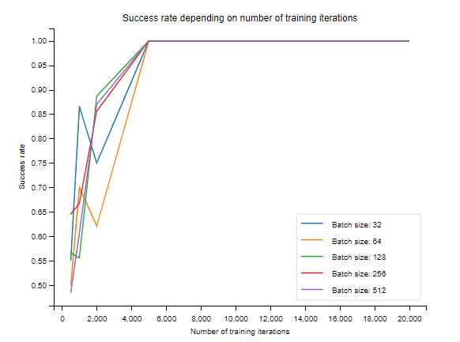

# Tiny Neural Network

<center></center>

This is a tiny neural network implementation in Python3/NumPy. It is designed to be as simple as possible, while still being flexible enough to solve a wide range of problems. It is not optimized for speed or numerical precision, but instead to be easy to understand and hack.

You can train a network using TensorFlow and use the TNN lib to make predictions.

## Usage

Paste the code into your project and use it as follows:

```python
import TinyNeuralNetwork as tnn

neural_network = tnn.TinyNeuralNetwork(inputLayers, outputLayers, hiddenLayers)
# first, train the network
neural_network.train(training_data, batchSize, trainingIterations, learningRate)
# then, use the network
output = neural_network.get_output(test_data)
```
## Export model

In order to properly export the model, you need to save the weights and biases of the network.

First, avoid module import by pasting your training code at the end of the file TinyNeuralNetwork.py. 

Then, add the following code at the end of your training code:

```python
#export model
import pickle
dump = pickle.dumps(neural_network)
import zlib
compressed_dump = zlib.compress(dump)
import base64
str = base64.b64encode(compressed_dump)
print("Exported model:")
print(str)
```

## Import model

To import the model, you need to paste the code of the TinyNeuralNetworkLite.py (without all training stuff) file into your project and then use the following code:

```python
# import model
model = b'YOUR_MODEL_STRING'
neural_network_loaded = import_model(model) 
```
Then you can use the network as usual.

## Hyperparameters tweaking

The hyperparameters are the following:

- inputLayers: number of input neurons (fixed by your data)
- outputLayers: number of output neurons (fixed by your data)
- hiddenLayers: number of hidden neurons
- batchSize: number of training samples per batch
- trainingIterations: number of training iterations
- learningRate: learning rate

You need to tweak these parameters in order to get the best results. 

You can use the file **HyperparametersTweaking.py** to find the best hyperparameters for your data.

This file will generate a graph with the success rate of the network for each hyperparameters combination.

Example of graph with the actual code with the xor algorithm:



## TensorFlow training

You can train your NN with TensorFlow and then export the model to use it with TNN.

Example in the file **Example/TensorFlowExample.py**.

You need to use only Sigmoïd activation function inside your TensorFlow model. Then, create a TNN model with the same number of layers and the same number of neurons per layer. Finally, copy the weights and biases from the TensorFlow model to the TNN model.

```python
# Export weights and biases from TensorFlow model
weights = []
biases = []
for layer in model.layers:
    weights.append(layer.get_weights()[0])
    biases.append(layer.get_weights()[1])

# Create TNN model with the same number of layers and the same number of neurons per layer, and insert the weights and biases
tiny_neural_network = tnn.TinyNeuralNetwork(5, 1, [64, 32], (weights, biases))
```

You can then use the TNN model as usual.